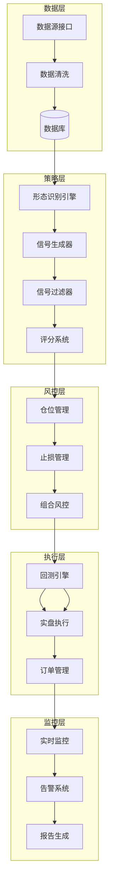

# 量化交易系统优化方案

> 基于对 k_line_code/ 和 quant_system/ 的深度分析，结合顶级量化交易经验提出的优化建议

## 一、形态识别模块优化 (k_line_code/)

### 1.1 形态识别参数自适应

**现状问题**: 当前形态识别使用固定参数，如趋势判断周期、形态阈值等，在不同市场环境下表现差异大。

**优化方案**:
```
- 引入自适应参数机制，根据市场波动率(ATR)动态调整
- 趋势判断周期：高波动市场缩短周期，低波动市场延长周期
- 形态确认阈值：根据近期形态成功率动态调整
```

**实现建议**:
- 创建 `adaptive_params.py` 模块
- 实现基于滚动窗口的参数优化
- 添加市场状态分类(趋势/震荡)

### 1.2 形态识别质量评分

**现状问题**: 当前形态识别只返回 0/1 二值结果，缺乏置信度评估。

**优化方案**:
```
- 返回形态强度评分 (0-100)
- 考虑因素：
  - 形态标准程度(实体大小比例、影线长度)
  - 出现位置(支撑/阻力位附近加分)
  - 与均线的相对位置
  - 成交量配合程度
```

### 1.3 新增高级形态识别

**建议新增**:
- **谐波形态**: Gartley、Butterfly、Bat、Crab
- **图表形态**: 头肩顶/底、双顶/底、三角形整理
- **K线组合**: 多日组合形态、连续形态序列
- **量价形态**: OBV背离、量价齐升/跌

### 1.4 形态数据库与回测

**优化方案**:
```
- 记录每次形态识别结果到数据库
- 统计各形态在不同市场的成功率
- 实现形态有效性动态评估
- 自动淘汰低效形态
```

---

## 二、风险管理模块优化 (risk_utils.py)

### 2.1 凯利公式仓位管理

**现状问题**: 当前使用固定风险比例(2%)，未考虑策略期望收益。

**优化方案**:
```python
# 凯利公式
f* = (p * b - q) / b
# 其中: p=胜率, q=败率, b=盈亏比

# 实现半凯利以降低风险
position_size = kelly_fraction * 0.5
```

### 2.2 组合级风险管理

**现状问题**: 当前风险管理针对单笔交易，缺乏组合层面控制。

**优化方案**:
```
- 行业集中度限制：单一行业不超过总仓位30%
- 相关性控制：高相关资产总仓位限制
- 最大回撤控制：组合回撤超15%降低整体仓位
- 动态相关性监控：实时计算资产相关性矩阵
```

### 2.3 多层次止损机制

**优化方案**:
```
1. 技术止损: ATR动态止损(已有)
2. 时间止损: 持仓N日后未盈利则退出
3. 盈亏止损: 盈利回撤一定比例触发
4. 信号止损: 反向信号出现时退出
5. 波动率止损: 异常波动时减仓
```

### 2.4 VaR和CVaR风险度量

**新增功能**:
```python
def calculate_var(returns, confidence=0.95):
    """计算在险价值"""
    return np.percentile(returns, (1 - confidence) * 100)

def calculate_cvar(returns, confidence=0.95):
    """计算条件在险价值(预期亏损)"""
    var = calculate_var(returns, confidence)
    return returns[returns <= var].mean()
```

---

## 三、回测引擎优化 (backtest_engine.py)

### 3.1 样本外测试

**现状问题**: 当前回测可能存在过拟合风险。

**优化方案**:
```
- Walk-Forward Analysis (滚动前向分析)
  - 训练期: 优化参数
  - 测试期: 验证效果
  - 滚动窗口重复上述过程

- 样本外期间设定:
  - 保留最近20%数据作为测试集
  - 报告样本外表现指标
```

### 3.2 蒙特卡洛模拟

**新增功能**:
```
- 对交易结果进行重采样
- 生成权益曲线分布
- 计算最大回撤置信区间
- 评估策略稳健性
```

### 3.3 交易成本精细化

**现状问题**: 当前佣金和滑点设置较为简单。

**优化方案**:
```
- 区分不同市值股票的滑点
- 考虑涨跌停板无法成交的情况
- 添加冲击成本模型(大单)
- 考虑买卖价差
```

### 3.4 基准对比与Alpha分析

**新增功能**:
```python
def calculate_alpha_beta(strategy_returns, benchmark_returns):
    """计算Alpha和Beta"""
    beta = np.cov(strategy_returns, benchmark_returns)[0,1] / np.var(benchmark_returns)
    alpha = np.mean(strategy_returns) - beta * np.mean(benchmark_returns)
    return alpha, beta

def calculate_information_ratio(strategy_returns, benchmark_returns):
    """计算信息比率"""
    excess_returns = strategy_returns - benchmark_returns
    return np.mean(excess_returns) / np.std(excess_returns)
```

---

## 四、信号系统优化 (budget_monitor.py)

### 4.1 动态权重系统

**现状问题**: 当前评分权重固定(如Morning Star=3, Engulfing=2)。

**优化方案**:
```
- 基于历史表现动态调整权重
- 定期重新评估各形态有效性
- 市场状态适配权重(趋势/震荡市场不同权重)
```

### 4.2 多时间框架确认

**优化方案**:
```
- 日线信号需周线趋势确认
- 添加60分钟/30分钟图确认
- 多周期共振提高信号质量
```

### 4.3 信号过滤机制

**新增过滤条件**:
```
- 市场环境过滤: 大盘弱势时降低做多信号
- 板块轮动过滤: 避免弱势板块
- 流动性过滤: 成交额低于阈值不交易
- 波动率过滤: 极端波动时暂停交易
```

### 4.4 机器学习信号融合

**优化方案**:
```
- 收集历史信号和结果数据
- 训练分类模型(XGBoost/LightGBM)
- 特征工程:
  - 各形态信号
  - 技术指标状态
  - 市场环境指标
  - 情绪指标
- 输出: 交易概率和预期收益
```

---

## 五、系统架构优化

### 5.1 数据层优化

**现状问题**: 数据从腾讯/新浪API实时获取，无本地存储。

**优化方案**:
```
- 引入SQLite/PostgreSQL数据库
- 数据表设计:
  - stock_daily: 日线数据
  - stock_info: 股票基本信息
  - pattern_history: 形态识别历史
  - trade_history: 交易记录
  - signal_history: 信号记录
- 定时数据更新任务
- 数据完整性校验
```

### 5.2 API标准化

**优化方案**:
```python
# 统一数据接口
class DataProvider(ABC):
    @abstractmethod
    def get_daily_data(self, code, start, end): pass
    
    @abstractmethod
    def get_realtime_data(self, codes): pass

# 多数据源支持
class TushareProvider(DataProvider): ...
class AkshareProvider(DataProvider): ...
class LocalDBProvider(DataProvider): ...
```

### 5.3 配置管理

**优化方案**:
```
- 使用YAML配置文件
- 环境区分(dev/test/prod)
- 敏感信息加密存储
- 配置热更新支持
```

### 5.4 日志与监控

**优化方案**:
```
- 结构化日志(JSON格式)
- 日志级别动态调整
- 关键指标监控:
  - 信号生成频率
  - 形态识别成功率
  - 系统响应时间
  - 错误率统计
- Grafana可视化面板
```

---

## 六、新增功能建议

### 6.1 策略组合管理

```
- 多策略并行运行
- 策略相关性分析
- 策略权重动态分配
- 策略表现归因分析
```

### 6.2 实时风控仪表盘

```
- Web界面展示
- 实时持仓盈亏
- 风险指标监控
- 预警信息展示
- 一键平仓功能
```

### 6.3 自动化报告

```
- 每日收盘报告
- 周度/月度总结
- 形态有效性报告
- 风险分析报告
- PDF/HTML格式输出
```

### 6.4 回测可视化

```
- 权益曲线图
- 回撤分析图
- 持仓分布图
- 月度收益热力图
- 交互式图表(Plotly)
```

---

## 七、性能优化

### 7.1 并行计算

```python
# 使用multiprocessing或concurrent.futures
from concurrent.futures import ProcessPoolExecutor

def scan_market_parallel(codes, pattern_func):
    with ProcessPoolExecutor(max_workers=4) as executor:
        results = list(executor.map(pattern_func, codes))
    return results
```

### 7.2 数据缓存

```python
# 使用Redis或内存缓存
from functools import lru_cache
import redis

@lru_cache(maxsize=1000)
def get_cached_data(code, date):
    return fetch_data(code, date)
```

### 7.3 向量化计算

```python
# 使用NumPy/Pandas向量化替代循环
# 当前: for循环计算
# 优化: 使用pandas rolling/apply
```

---

## 八、实施优先级

### 高优先级 (立即实施)
1. ✅ 形态识别质量评分
2. ✅ 动态权重系统
3. ✅ 组合级风险管理
4. ✅ 数据库存储

### 中优先级 (短期实施)
1. ⬜ 样本外测试
2. ⬜ 多时间框架确认
3. ⬜ 凯利公式仓位管理
4. ⬜ 配置管理优化

### 低优先级 (长期规划)
1. ⬜ 机器学习信号融合
2. ⬜ 谐波形态识别
3. ⬜ 实时风控仪表盘
4. ⬜ 自动化报告系统

---

## 九、预期收益提升

| 优化方向 | 预期收益提升 | 风险降低 |
|---------|-------------|---------|
| 形态质量评分 | +5-10% | - |
| 动态权重 | +3-5% | - |
| 组合风险管理 | - | 15-20% |
| 多时间框架确认 | +2-3% | 5-10% |
| 机器学习融合 | +10-15% | - |
| 样本外测试 | - | 10-15% |

**综合预期**: 年化收益提升15-30%，最大回撤降低20-35%

---

## 十、系统架构图



---

*文档版本: v1.0*
*创建时间: 2026-02-21*
*作者: AI量化顾问*
